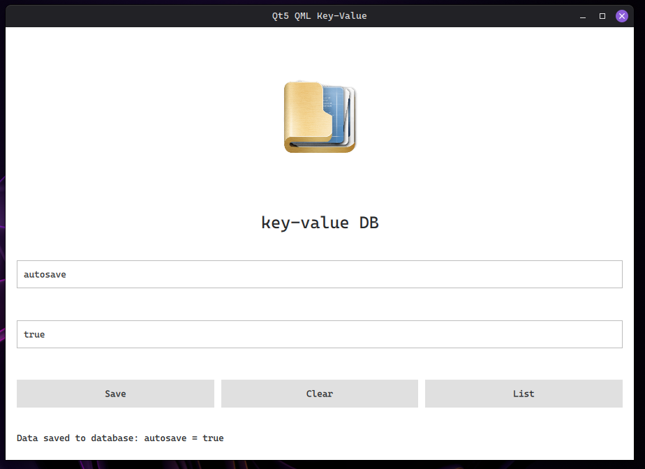
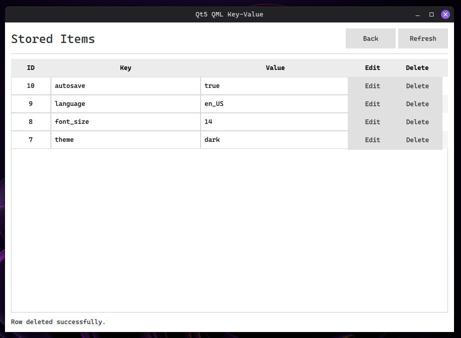

# KeyVaultLite

## Screenshot




Lightweight Linux desktop application for managing `key -> value` pairs with a modern Qt/QML interface and SQLite storage.

Built with:
- C++
- Qt / QML
- SQLite

## Features

- Add key-value pairs
- Edit existing entries
- Delete records
- Persistent SQLite storage
- Simple and clean QML UI

## Dependencies

Install required packages on Ubuntu/Debian:
```bash
sudo apt install \
qtbase5-dev \
qtdeclarative5-dev \
qml-module-qtquick-controls2 \
qml-module-qtquick-layouts \
qml-module-qtquick-window2 \
qml-module-qtquick2 \
libqt5sql5-sqlite \
cmake
```

## Build
```bash
cmake -S . -B build
cmake --build build
```

## Run
```bash
./build/KeyVaultLite
```

## Database
The application stores all data in a local SQLite database file:
```bash
kv_store.db
```